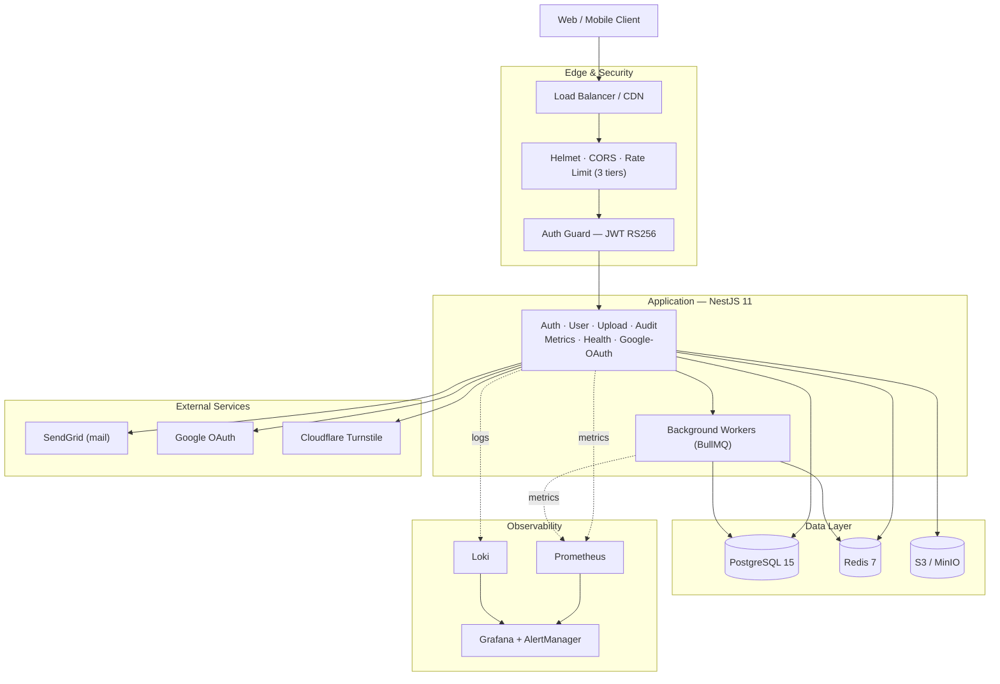
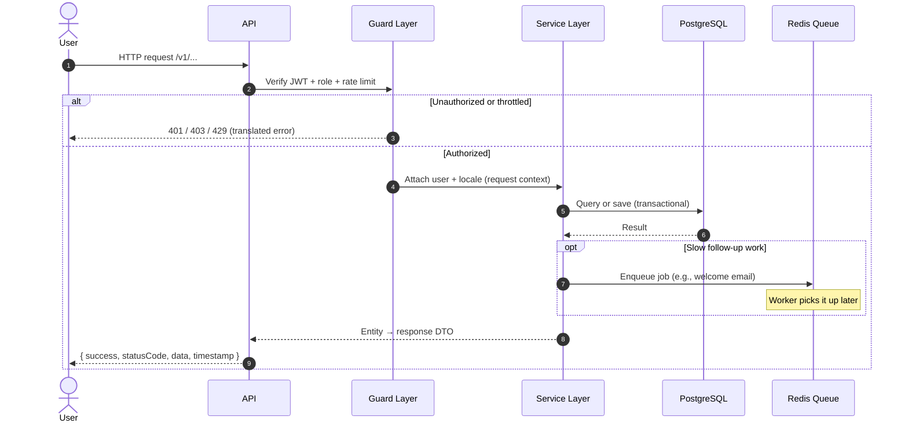
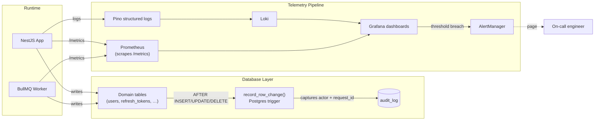

# api-boilerplate — Architecture

A one-page review of this NestJS 11 boilerplate: what's wired up, where it shines,
where it cuts, and which scale band it actually fits. For evaluation before adoption
— not a feature list (`README.md`) and not a deep dive (`docs/architecture.md`).

**Core tradeoff:** ships with production-grade auth, observability, audit, and i18n
already wired — at the cost of a heavy infra footprint, single-tenant lock-in, and
zero tests in the box.

## Stack at a glance

| Concern       | Choice                                   | Lives in               |
|---------------|------------------------------------------|------------------------|
| Framework     | NestJS 11, Node 22+ (ESM, SWC)           | `src/`                 |
| Language      | TypeScript 5.8 (`.js` import extensions) | everywhere             |
| Database      | PostgreSQL 15 + TypeORM 0.3.20           | `src/database/`        |
| Queues        | BullMQ on Redis 7                        | `src/app.module.ts`    |
| Auth          | JWT RS256 + refresh + 2FA + Google OAuth | `src/modules/auth*/`   |
| Files         | AWS S3 / MinIO + sharp                   | `src/shared/services/` |
| Mail          | SendGrid + Handlebars                    | `src/shared/mail/`     |
| Observability | Pino -> Loki, Prometheus, Grafana        | `monitoring/`          |
| i18n          | nestjs-i18n (en / ar / fr)               | `src/i18n/`            |
| Load tests    | k6 (smoke / ramp / sustained / spike)    | `load-tests/`          |

## Visual architecture (for presentations)

These three diagrams are written in **Mermaid** — they render directly in GitHub, Notion, and most slide tools, and can be exported to PNG via [mermaid.live](https://mermaid.live). Labels are plain-English, no class names: the goal is a slide a non-engineer can follow.

### 1. System architecture

The system at a glance: clients hit the API through a security edge, the API talks to its data stores and external services, background workers handle slow tasks, and the entire fleet emits metrics and logs into an observability pipeline.


<details>
<summary>Mermaid source</summary>



</details>

### 2. Request cycle — from click to response

What happens between a click and the response. The guard layer rejects unauthorized or throttled traffic before any business code runs; valid requests flow through to the service layer, which talks to the database inside a transaction. Slow follow-up work (sending mail, processing an image) is handed to a queue so the user still gets a fast reply.


<details>
<summary>Mermaid source</summary>



</details>

### 3. Observability + Audit cycle — how nothing slips through

Two independent trails capture every action. **Audit** is enforced by the database itself: a Postgres trigger fires on every row change and writes to the audit log, capturing who did it and which request it belonged to — even for cascaded deletes. **Observability** runs in parallel: app logs and metrics flow into Loki and Prometheus, surface as Grafana dashboards, and page the on-call engineer when a threshold breaks.


<details>
<summary>Mermaid source</summary>



</details>

## Module map

```
   HTTP /v1
      |
      v
   Helmet · CORS · Throttler · CLS
   AuthGuard · SystemRoleGuard · ValidationPipe
   AuthUserInterceptor · SuccessResponseInterceptor
      |
      +--------+---------+----------+--------+----------+
      |        |         |          |        |          |
     auth    user     upload    metrics   health   audit · auth-google
      |        |         |          |        |          |
      v        v         v          v        v          v
   Postgres · Redis · S3/MinIO · SendGrid · Loki · Prometheus
```

## Request lifecycle

```
  request
   -> helmet · compression · CORS · URI version (/v1)
   -> CLS store · ThrottlerGuard (3-tier RPS)
   -> AuthGuard (RS256 JWT) · SystemRoleGuard · AuthUserInterceptor
   -> I18nValidationPipe
   -> Controller -> Service (@Transactional) -> Repository (parameterized SQL)
   -> entity.toDto()
   -> SuccessResponseInterceptor -> { success, statusCode, data, timestamp, path }

  errors -> AllExceptionsFilter -> HttpExceptionFilter (i18n)
         -> I18nValidationFilter -> QueryFailedFilter (DB constraints)
```

## What's pre-wired

- 7 modules: `auth`, `auth-google`, `user`, `upload`, `health-checker`, `metrics`, `audit`.
- DB-level audit: `audit_log` populated by the `record_row_change()` Postgres trigger.
  `AuditService.onApplicationBootstrap()` installs the trigger functions and attaches them
  to every table in the `AUDITED_TABLES` registry on each boot.
  `TransactionContextSubscriber` propagates `app.current_user_id` and `app.request_id` so
  audit rows carry actor context — even on `ON DELETE CASCADE`.
- HTTP RED metrics, BullMQ queue gauges, Grafana dashboards, AlertManager rules.
- 3-tier rate limits, Cloudflare Turnstile captcha, branded `Uuid`, `@Transactional()`,
  `nestjs-cls` request context, custom field decorators (`@StringField`, `@UUIDField`, ...).

## Strengths

- **Real observability, not aspirational.** Prometheus + Loki + Grafana + AlertManager configs and dashboards ship in `monitoring/`. Most boilerplates stop at "we use Pino".
- **Audit log at the database layer.** Triggers fire even when code bypasses TypeORM (raw SQL, migrations) and capture cascaded deletes. Compliance-ready out of the box.
- **Conventions are documented and enforceable.** Zero-tolerance rules in `docs/conventions/coding-standards.md`; AI review prompts in `docs/ai/prompts.md`.
- **Clean request scoping.** `nestjs-cls` + `typeorm-transactional` remove parameter-drilling for user/lang/transaction context.
- **Custom field decorators collapse boilerplate.** `@StringField()` = validation + Swagger + transform.
- **Multi-locale from day one** (en / ar / fr) with i18n-aware exceptions, plus k6 load scenarios pre-written in `load-tests/scenarios/`.

## Weaknesses & risks

- **Zero tests written.** `find src -name "*.spec.ts"` returns nothing. Jest is configured; `test/` only holds config. Convention examples in docs aren't backed by green tests.
- **Single-tenant by design.** `docs/architecture.md` is explicit: no `Organization` model. Multi-tenancy is a fork, not a flag.
- **Heavy infra footprint.** `docker-compose-local.yml` runs ~9 services (Postgres, Redis, MinIO, Prometheus, Loki, Grafana, AlertManager, PgAdmin, exporters).
- **Postgres-locked.** Audit triggers, `set_config`, `VirtualColumn` queries all assume Postgres — switching DBs means rewriting audit.
- **REST-only, monolith-first.** No GraphQL, tRPC, WebSocket, or message-bus scaffolding; decomposing later is non-trivial.
- **Steep onboarding.** Branded `Uuid`, ESM `.js` imports, four-stage filter chain, custom decorators, `Array.prototype` polyfills — non-trivial for new contributors.
- **Vendor coupling.** SendGrid, Turnstile, AWS S3 wired directly — swappable but not behind interfaces.
- **Pre-launch state.** Migrations folder ships empty — the audit trigger is installed at app boot via `CREATE OR REPLACE FUNCTION` instead, which forfeits the audit-log partitioning the architecture spec mentions.

## Scale fit

| Stage / DAU         | Verdict            | Why                                              |
|---------------------|--------------------|--------------------------------------------------|
| Prototype (<100)    | **Overkill**       | 9-service infra, weeks of unused conventions.    |
| Early (100 – 10k)   | **Conditional**    | Worth it if audit/compliance matters.            |
| Mid (10k – 500k)    | **Sweet spot**     | Observability + audit pay off here.              |
| Late (500k – 5M)    | **Fits with work** | Add read replicas, shard queues, split monolith. |
| Hyperscale (5M+)    | **Outgrown**       | Single Postgres + single-tenant become bottleneck.|

**One-line summary:** best fit is a single-tenant B2B or regulated B2C product at
10k–500k DAU where compliance and audit trails are non-negotiable.

## Verdict

Adopt this if you're building a single-tenant API where regulatory audit, observability,
and documented conventions matter more than a fast first day. Look elsewhere if you're
shipping an MVP next week, building multi-tenant SaaS, or need GraphQL/realtime out of
the box. If you do adopt: (1) write tests — the framework is set up, the suite is empty;
(2) generate your initial migration — none ship; (3) decide which of the nine docker
services you actually need before booting them all.
